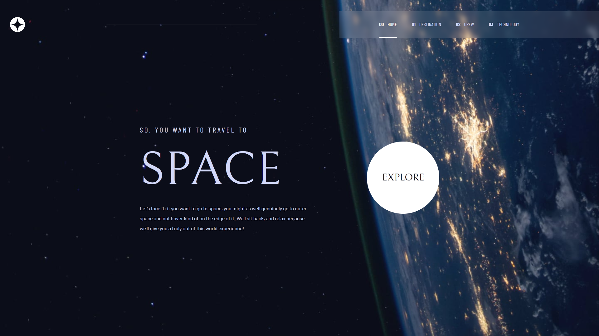
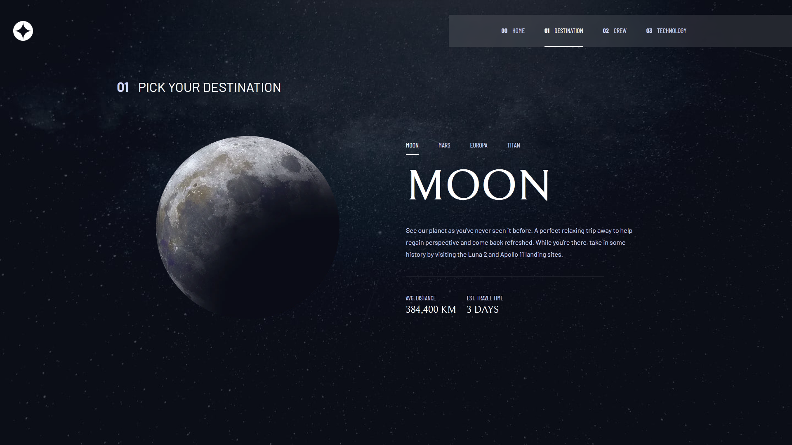
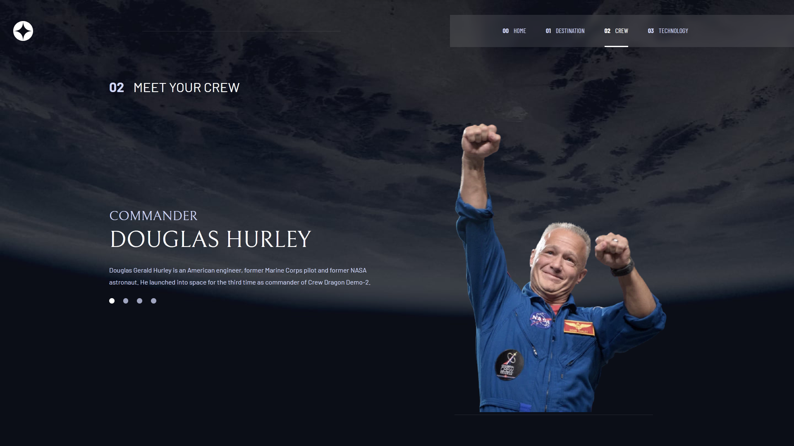
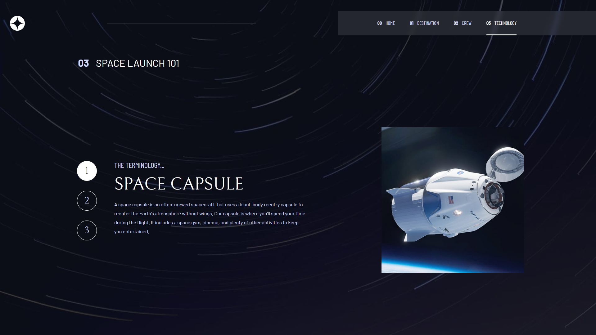

# Frontend Mentor - Space tourism website solution

This is a solution to the [Space tourism website challenge on Frontend Mentor](https://www.frontendmentor.io/challenges/space-tourism-multipage-website-gRWj1URZ3).

### The challenge

Users should be able to:

- View the optimal layout for each of the website's pages depending on their device's screen size
- See hover states for all interactive elements on the page
- View each page and be able to toggle between the tabs to see new information

### Screenshot

### Links
- Live Site URL: https://anshul-g.github.io/SpaceTravel/

### Built with

- Semantic HTML5 markup
- CSS custom properties and utility classes
- Media queries
- Flexbox
- CSS Grid
- JavaScript
- Desktop-first workflow